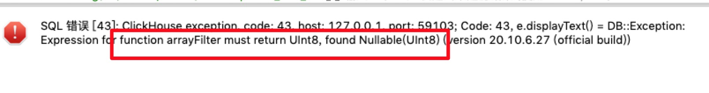

问题：

```
SELECT
    parent_sale_ord_id,
    lower(user_log_acct) AS user_log_acct,
    after_prefr_amount,
    substring(deal_tm, 1, 10) AS d,
    substring(toString(toStartOfHour(parseDateTimeBestEffort(deal_tm))), 12, 8) AS h,
    arrayFilter(v -> (v >= h), ['00:00:00', '01:00:00', '02:00:00', '03:00:00', '04:00:00', '05:00:00', '06:00:00', '07:00:00', '08:00:00', '09:00:00', '10:00:00', '11:00:00', '12:00:00', '13:00:00', '14:00:00', '15:00:00', '16:00:00', '17:00:00', '18:00:00', '19:00:00', '20:00:00', '21:00:00', '22:00:00', '23:00:00']) AS hour_arrs
FROM
(
    SELECT
        parent_sale_ord_id,
        sale_ord_id,
        sku_id,
        argMax(after_prefr_amount, update_time) AS after_prefr_amount,
        argMax(user_log_acct, update_time) AS user_log_acct,
        argMax(deal_flag, update_time) AS deal_flag,
        argMax(ord_deal_tm, update_time) AS deal_tm
    FROM union_order_onl_mix.union_order_onl_detail
    WHERE (dt = '2020-12-18') AND (ord_deal_tm != NULL) AND (ord_deal_tm < '2020-12-18 18:00:00')
    GROUP BY
        parent_sale_ord_id,
        sale_ord_id,
        sku_id
)
WHERE deal_flag = '1'
```

复现
```
SELECT parent_sale_ord_id
FROM union_order_onl_mix.union_order_onl_detail
WHERE (dt = '2020-12-18') AND (ord_deal_tm < '2020-12-18 18:00:00') AND (ord_deal_tm != NULL)
GROUP BY parent_sale_ord_id 
```
问题原因：ord_deal_tm 字段之前是 nullable string，也导入了一些数据，后来修改成了 string 类型，但是数据没有冲刷，导致的；重刷数据之后解决.

建标语句:
```
CREATE TABLE union_order_onl_mix.union_order_onl_detail
(
    `parent_sale_ord_id` String,
    `sale_ord_id` String,
    `after_prefr_amount` Float64,
    `user_log_acct` String,
    `unify_user_log_acct` String,
    `intra_flag` String,
    `deal_flag` String,
    `sku_id` String,
    `main_sku_id` String,
    `shadow_sku_flag` String,
    `spu_id` String,
    `sale_mode_cd_1` String,
    `pop_id` String,
    `vender_id` String,
    `shop_id` String,
    `brand_id` String,
    `main_brand_id` String,
    `item_first_cate_cd` String,
    `item_second_cate_cd` String,
    `item_third_cate_cd` String,
    `item_last_cate_cd` String,
    `bu_id` String,
    `work_post_cd` String,
    `dept_id_1` String,
    `dept_id_2` String,
    `dept_id_3` String,
    `dept_id_4` String,
    `dept_id_5` String,
    `dept_id_6` String,
    `saler_erp_acct` String,
    `pop_operator_erp_acct` String,
    `purchaser_control_erp_acct` String,
    `union_id` String,
    `subunion_id` String,
    `eu_id` String,
    `union_pin` String,
    `pid` String,
    `union_type` String,
    `master_flag` String,
    `rule_id` String,
    `rule_type` String,
    `rule_type_name` String,
    `union_traffic_type` String,
    `union_traffic_name_new` String,
    `union_traffic_name` String,
    `order_time` String,
    `check_account_time` String,
    `click_time` String,
    `update_time` String,
    `ver` DateTime DEFAULT toDateTime(update_time),
    `dt` Date DEFAULT toDate(update_time),
    `ord_deal_tm` String
)
ENGINE = Distributed('KC0_CK_TS_01', 'union_order_onl_mix', 'union_order_onl_detail_local', rand())
```
